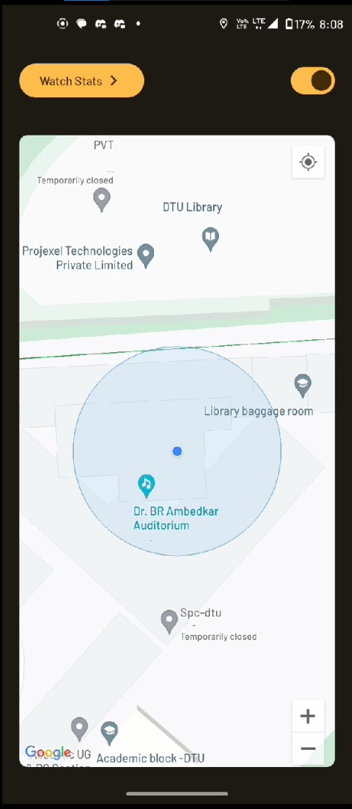
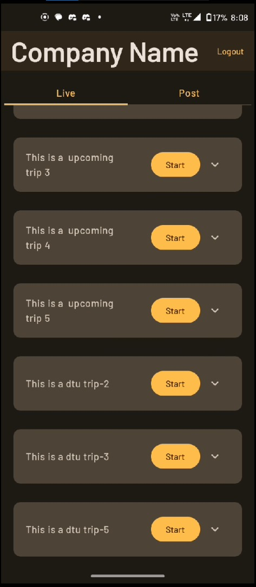
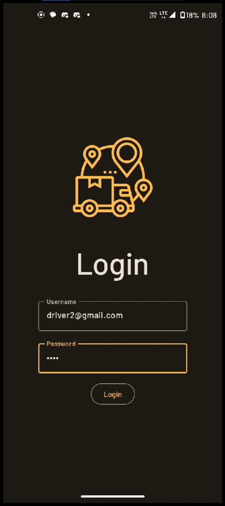

# TrackIT Driver App

**Problem Statement:**

In an era where transportation plays a pivotal role in our lives, ensuring the safety, efficiency, and reliability of each journey is of paramount importance. To address the growing need for comprehensive trip monitoring and tracking, we present the Trip Monitoring System for this hackathon.

**Problem Description:**

The problem at hand is to develop an innovative, real-time trip monitoring system with the capability to provide live tracking and detailed playback of a trip. This system will serve as an indispensable tool for enhancing the safety, efficiency, and overall monitoring of the travel.

## Features

List the key features of your project.

- Vehicle Live Tracking
- Network Loss Handling

## Tech Stack

- Jetpack Compose
- Socket IO

# Screenshots

